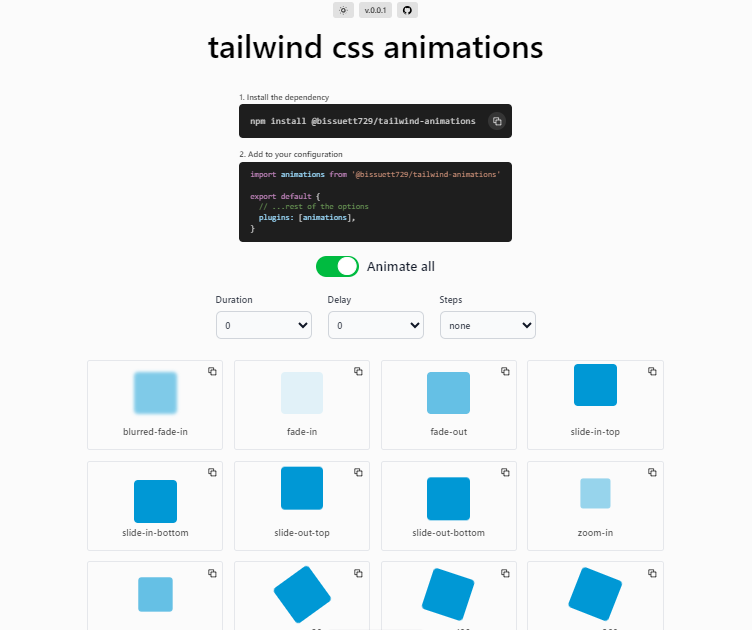

<div align="center">

# Awesome Tailwind Animations



Get your animations easily done with only Tailwind CSS classes.

Visit the [website](https://tailwindcss-animations.vercel.app/) to get more information.
</div>
  
## Installation :book:

#### Package install

> Install the package with your favorite package manager:

- npm
```bash
npm install @bissuett729/tailwind-animations
```
- pnpm
```bash
pnpm install @bissuett729/tailwind-animations
```
- yarn
```bash
yarn add @bissuett729/tailwind-animations
```

#### Plugin Implementation
> Use the plugin in your Tailwind CSS project:

```js
// tailwind.config.mjs
import animations from '@bissuett729/tailwind-animations'

export default {
  // rest of the options
  plugins: [
    animations
  ],
}
```

## Usage :gear:

#### Example

> Here are some simple examples of how to use this plugin and its animations:

```html
<div class="animate-fade-in">
  Fade in box
</div>

<div class="animate-slide-in-bottom animate-delay-300 animate-duration-slow">
  Slow animation after 300ms to slide in from bottom
</div>
```
